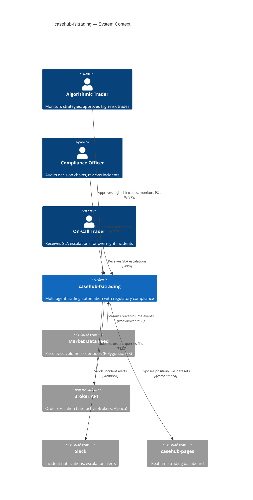
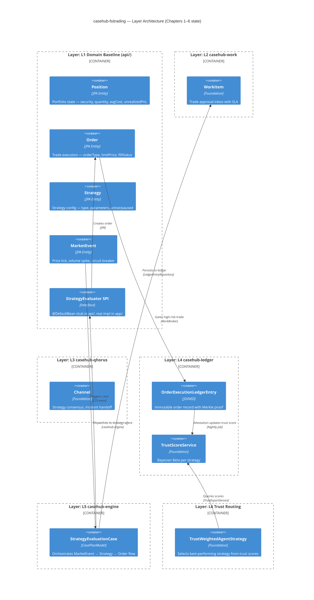

# casehub-fsitrading — ARC42STORIES.MD

**Spec:** Arc42Stories v0.1  
**Profile:** CaseHub — Application tier  
**Profile ref:** `../parent/docs/arc42stories-casehub-profile.md` · fallback: `https://raw.githubusercontent.com/casehubio/parent/main/docs/arc42stories-casehub-profile.md`  
**Prefix:** `FSI`

---

## §1 Introduction and Goals

### What This Application Is

`casehub-fsitrading` automates algorithmic trading strategy execution with multi-agent accountability, human oversight gates for high-risk trades, and tamper-evident regulatory compliance (MiFID II Art.17, Dodd-Frank, MAR).

**Core problem:** Overnight trading bots operate unsupervised. When market conditions shift (flash crash, liquidity event, overnight gap), strategies fail silently or execute catastrophic trades. By morning, the damage is done. No decision chain. No real-time escalation. No learned response from past incidents.

**Solution:** Every strategy is an agent with a trust score learned from P&L attestations. Unusual trades gate on human approval (WorkItem with SLA). Market incidents feed case-based reasoning — past flash crashes inform future anomaly detection. All decisions flow to an immutable ledger with Merkle proofs for regulatory audit.

### Stakeholders

| Role | Concern |
|---|---|
| Algorithmic trader | Strategy performance, real-time P&L visibility, rapid incident response |
| Risk officer | Pre-trade approval for large/unusual positions, real-time risk metrics |
| Compliance officer | MiFID II Art.17 audit trail, MAR market abuse detection, Dodd-Frank reporting |
| On-call trader | SLA-driven escalation when overnight bots breach thresholds |
| Regulator | Tamper-evident decision chain from market event → strategy evaluation → order execution |

### Quality Goals

| Priority | Quality | Scenario |
|---|---|---|
| 1 | **Auditability** | Every order traces back to triggering MarketEvent + Strategy + AgentDescriptor via ledger causedByEntryId chain |
| 2 | **Responsiveness** | Overnight incident escalates to on-call trader within 5 minutes if bot cannot resolve autonomously |
| 3 | **Safety** | High-risk trade (size > $1M or volatility > 2σ) blocks on human approval before execution |
| 4 | **Adaptability** | Trust scores update nightly from P&L attestations; poorly-performing strategies automatically deprioritized |
| 5 | **Transparency** | Real-time Pages dashboard shows: open positions, P&L timeline, agent trust scores, strategy performance, incident log |

---

## Artifact Schema

Inherited from CaseHub Profile. Project-specific additions:

| Artifact type | Format | Example | Where it lives |
|---|---|---|---|
| Improvement log entry | `FSI-NNN` | `FSI-042` | `docs/PROGRESS.md` |
| Issue | `#NNN` or `casehubio/fsitrading#NNN` | `#52` | GitHub Issues |
| Market incident report | `MIR-YYYYMMDD-HHmm` | `MIR-20260615-0237` | workspace `incidents/` |

---

## §2 Constraints

### Technical

| Constraint | Impact |
|---|---|
| Java 21 (running on Java 26 JVM) | Language baseline; no virtual threads syntax yet (Java 21 doesn't have structured concurrency) |
| Quarkus 3.32.2 | Framework version aligned with casehub-parent BOM |
| GraalVM 25 native image target | All dependencies must be native-compatible; reflection requires registration |
| CaseHub foundation dependency order | Cannot use casehub-engine before casehub-ledger integrated |
| Maven multi-module (api/ + app/) | Domain SPIs in api/ (pure Java, no JPA); application logic in app/ |

### Organizational

| Constraint | Impact |
|---|---|
| No real market data initially | Use synthetic market data generator for Chapters 1–4; real feed integration deferred to Chapter 5+ |
| No broker integration initially | Order execution simulated in Chapter 1–3; real broker API (Interactive Brokers, Alpaca) deferred to Chapter 6+ |

### Regulatory

| Constraint | Impact |
|---|---|
| MiFID II Art.17 — algo trading audit | Every trade decision must trace to: triggering event, strategy logic, agent identity, human authorization (if required) |
| Dodd-Frank — algo trading compliance | Real-time risk checks required before order submission; kill-switch capability mandatory |
| MAR — market abuse detection | Pattern detection for wash trading, spoofing, layering — flags for compliance review |

---

## §3 Context and Scope

### System Context

### External Interfaces

| Interface | Direction | Protocol | Purpose |
|---|---|---|---|
| Market data feed | Inbound | WebSocket (CloudEvent) | Real-time price ticks, volume, order book updates |
| Broker API | Outbound | REST | Order submission, fill status, position queries |
| Slack | Outbound | Webhook | Incident alerts, SLA escalation notifications |
| casehub-pages dashboard | Outbound | Dataset API (JSON) | Position overview, P&L timeline, strategy performance |

### Platform References

- `docs/PLATFORM.md` — capability ownership and boundary rules
- `docs/repos/casehub-fsitrading.md` — what this application owns
- `docs/DOMAIN.md` — FSI trading domain background (market microstructure, compliance frameworks, strategy types)

---

## §4 Solution Strategy

### Core Architectural Decisions

**Multi-agent trading harness:** Each strategy is an agent (`AgentDescriptor`) with capability tags (e.g. `momentum`, `mean-reversion`, `arbitrage`). casehub-engine routes MarketEvent → best-performing strategy via trust-weighted selection. Bayesian Beta scores update nightly from P&L outcome attestations.

**Case-based reasoning for market incidents:** Flash crashes, liquidity events, overnight gaps → stored in `CaseMemoryStore` (graph backend for temporal queries). Future anomalies retrieve similar past incidents via `CaseRetriever` SPI. Agents learn from history automatically.

**Human oversight gates for high-risk trades:** Large positions (> $1M notional) or high-volatility conditions (> 2σ) trigger a WorkItem with SLA. Trader must approve before order submission. MiFID II Art.17 compliance out of the box.

**Immutable audit trail:** Every order execution → `OrderExecutionLedgerEntry extends LedgerEntry` with Merkle proof. Causality chain: `MarketEvent → StrategyEvaluationLedgerEntry → OrderExecutionLedgerEntry` via `causedByEntryId`. Tamper-evident for regulatory inspection.

**Reactive market data ingestion:** `casehub-platform-streams-webhook` adapter receives price ticks as CloudEvents → `casehub-ras` (future) detects anomaly patterns → triggers case creation when threshold crossed.

### Layer Taxonomy

Follows CaseHub Application Tier natural integration sequence:

| Layer | Foundation module | What it adds |
|---|---|---|
| L1 Domain Baseline | *(pure Java)* | Position, Order, Strategy, MarketEvent entities; `@DefaultBean` StrategyEvaluator stub |
| L2 casehub-work | `casehub-work` | Human task lifecycle — WorkItem for trade approval, SLA breach escalation |
| L3 casehub-qhorus | `casehub-qhorus` | Agent mesh — strategy consensus, overnight incident handoff to on-call trader |
| L4 casehub-ledger | `casehub-ledger` | Tamper-evident audit — OrderExecutionLedgerEntry, trust scoring per strategy |
| L5 casehub-engine | `casehub-engine` | Orchestration — StrategyEvaluationCase, trust-weighted strategy selection |
| L6 Trust Routing | `casehub-engine-ledger` | Trust-weighted agent selection from P&L attestations |
| L7 Market Data Streams | `casehub-platform-streams-*` | CloudEvent ingestion from market data feeds |
| L8 Case Memory (CBR) | `casehub-platform-memory-*` | Graph-backed incident memory for CBR retrieval |
| L9 Pages Dashboard | `casehub-pages` | Real-time position/P&L/strategy performance view |

### Journey and Chapter Sequencing Rationale

Three Journeys:

**Journey 1: Automated Strategy Execution** — end-to-end from MarketEvent → StrategyEvaluation → OrderExecution with audit and trust scoring. Closes core accountability gaps. Chapters 1–6.

**Journey 2: Risk Management & Oversight** — high-risk trade gates, SLA-driven escalation, real-time risk metrics. Chapters 7–9.

**Journey 3: Market Intelligence & CBR** — incident memory, anomaly detection, learned response from past events. Chapters 10–12.

**Sequencing logic:**
- **C1 before C2:** C1 establishes domain model; C2 adds audit on top of it.
- **C2 before C3:** C2 creates ledger entries; C3 reads them for trust scores.
- **C3 before C4:** C4 (trust routing) requires C3 (trust scores) at runtime.
- **C4 before C7:** Risk gates (C7) need trust-weighted routing (C4) to select the best-performing risk classifier agent.
- **C5–C6 independent of C7–C9:** Market data and broker integration can proceed in parallel with risk management layers.
- **C10–C12 (CBR):** Deferred until core execution (C1–C6) and risk (C7–C9) are complete. CBR adds intelligence, not foundation.

---

## §5 Building Block View

### L1 Domain Baseline — Layer Architecture

---

## §6 Runtime View

🔲 Deferred to Chapter 1 close — will show end-to-end MarketEvent → StrategyEvaluation → OrderExecution flow as C4Dynamic sequence diagram.

---

## §7 Deployment View

🔲 Deferred to Chapter 6 close — will show production topology with market data ingestion, broker API integration, and Pages dashboard embedding.

---

## §8 Crosscutting Concepts

### Conventions

Inherited from CaseHub Profile:

| Concern | Protocol |
|---|---|
| Module structure | `casehub/garden: docs/protocols/universal/module-tier-structure.md` |
| Flyway migrations | `casehub/garden: docs/protocols/casehub/flyway-version-range-allocation.md` |
| CDI displacement | `casehub/garden: docs/protocols/casehub/alternative-extension-patterns.md` |
| Ledger subclass extension | `casehub/garden: docs/protocols/casehub/ledger-subclass-extension.md` |
| SPI placement | `docs/PLATFORM.md` §Step 4 |
| Architectural patterns | `docs/ARCHITECTURE.md` |

### Anti-Patterns

**Symptom:** WorkItem created for every order execution, even small trades. Inbox floods; trader cannot respond to real high-risk trades.  
**Cause:** No risk threshold check before `WorkBroker.create()`. Every order gates regardless of size or volatility.  
**Fix:** Implement `ActionRiskClassifier` SPI — return `PlannedAction` with risk level. casehub-engine gates only if `riskLevel > threshold`. Small trades bypass WorkItem creation entirely.

---

**Symptom:** Trust scores never update. All strategies weighted equally despite P&L differences.  
**Cause:** No outcome attestation after order execution. Ledger has `OrderExecutionLedgerEntry` but no attestation linking it to the strategy agent.  
**Fix:** After order fills, write `OutcomeAttestationEntry` with `causedByEntryId` pointing to `OrderExecutionLedgerEntry`. Include P&L as outcome value. Nightly `TrustScoreJob` reads attestations and updates Bayesian Beta.

---

**Symptom:** MarketEvent triggers case, but no strategy agent responds. Case stays in WAITING indefinitely.  
**Cause:** `AgentDescriptor` not registered for strategy workers. Engine cannot route to unregistered agents.  
**Fix:** On app startup, iterate all `Strategy` entities and call `AgentRegistry.register(AgentDescriptor)` for each active strategy. Include capability tags (e.g. `momentum`, `mean-reversion`) in descriptor.

---

## §9 Journeys and Chapters

### §9.1 Journey Overview

| Journey | Description | Chapters | Status |
|---|---|---|---|
| J1: Automated Strategy Execution | End-to-end MarketEvent → StrategyEvaluation → OrderExecution with audit and trust scoring | 1–6 | 🔨 In Progress (C1–C3 done) |
| J2: Risk Management & Oversight | High-risk trade gates, SLA escalation, real-time risk metrics | 7–9 | 🔲 Pending |
| J3: Market Intelligence & CBR | Incident memory, anomaly detection, learned response | 10–12 | 🔲 Pending |

```mermaid
flowchart LR
  subgraph J1["Journey 1: Automated Strategy Execution"]
    C1["C1: Domain Baseline\nL1"] --> C2["C2: Audit Trail\n+ L4 Ledger"]
    C2 --> C3["C3: Trust Scoring\n+ L4"]
    C3 --> C4["C4: Trust Routing\n+ L6"]
    C4 --> C5["C5: Market Data\n+ L7 Streams"]
    C5 --> C6["C6: Broker Integration\n+ L1 real exec"]
  end
  
  subgraph J2["Journey 2: Risk Management"]
    C6 --> C7["C7: Risk Gates\n+ L2 Work"]
    C7 --> C8["C8: SLA Escalation\n+ L3 Qhorus"]
    C8 --> C9["C9: Risk Dashboard\n+ L9 Pages"]
  end
  
  subgraph J3["Journey 3: Market Intelligence"]
    C9 --> C10["C10: Incident Memory\n+ L8 CBR"]
    C10 --> C11["C11: Anomaly Detection\n+ L7 RAS"]
    C11 --> C12["C12: Learned Response\n+ L5 adaptive"]
  end
  
  style C1 fill:#4CAF50,color:#fff
  style C2 fill:#4CAF50,color:#fff
  style C3 fill:#4CAF50,color:#fff
  style C4 fill:#D3D3D3,color:#000
  style C5 fill:#D3D3D3,color:#000
  style C6 fill:#D3D3D3,color:#000
  style C7 fill:#D3D3D3,color:#000
  style C8 fill:#D3D3D3,color:#000
  style C9 fill:#D3D3D3,color:#000
  style C10 fill:#D3D3D3,color:#000
  style C11 fill:#D3D3D3,color:#000
  style C12 fill:#D3D3D3,color:#000
```

---

### §9.2 Chapter Index

| # | Chapter | Journey | Layers touched | Delta summary | Status |
|---|---|---|---|---|---|
| 1 | Domain Baseline + Synthetic Execution | J1 | L1, L5 | High, High | ✅ Done |
| 2 | Immutable Audit Trail | J1 | + L4 | High | ✅ Done |
| 3 | Trust Scoring from P&L Attestations | J1 | L4 | Medium | ✅ Done |
| 4 | Trust-Weighted Strategy Selection | J1 | + L6 | High | 🔲 |
| 5 | Market Data Stream Ingestion | J1 | + L7 | High | 🔲 |
| 6 | Real Broker API Integration | J1 | L1 | Medium | 🔲 |
| 7 | High-Risk Trade Approval Gates | J2 | + L2 | High | 🔲 |
| 8 | SLA-Driven Overnight Escalation | J2 | + L3 | Medium | 🔲 |
| 9 | Real-Time Risk Dashboard | J2 | + L9 | Medium | 🔲 |
| 10 | Market Incident Memory (CBR Retain) | J3 | + L8 | High | 🔲 |
| 11 | Anomaly Detection & Situation Triggers | J3 | L7 | Medium | 🔲 |
| 12 | Learned Incident Response (CBR Reuse) | J3 | L5, L8 | Medium | 🔲 |

---

### Layer × Chapter Matrix

| Layer | C1 | C2 | C3 | C4 | C5 | C6 | C7 | C8 | C9 | C10 | C11 | C12 |
|---|---|---|---|---|---|---|---|---|---|---|---|---|
| L1 Domain Baseline | High | — | — | — | — | Medium | Low | — | — | — | — | — |
| L2 casehub-work | — | — | — | — | — | — | High | Low | — | — | — | — |
| L3 casehub-qhorus | — | — | — | — | — | — | — | High | — | — | — | — |
| L4 casehub-ledger | — | High | Medium | Low | — | — | Low | — | — | — | — | — |
| L5 casehub-engine | High | Low | Low | Low | — | — | Low | — | — | — | — | Medium |
| L6 Trust Routing | — | — | — | High | — | — | — | — | — | — | — | — |
| L7 Market Data Streams | — | — | — | — | High | — | — | — | — | — | Medium | — |
| L8 Case Memory (CBR) | — | — | — | — | — | — | — | — | — | High | Low | Medium |
| L9 Pages Dashboard | — | — | — | — | — | — | — | — | Medium | — | — | — |

---

### Sequencing Rationale

**Hard dependencies (blocking):**
- **C1 before C2:** C2 creates `OrderExecutionLedgerEntry extends LedgerEntry` — requires C1 domain model (`Order` entity).
- **C2 before C3:** C3 reads ledger attestations to compute trust scores — requires C2 ledger integration.
- **C3 before C4:** C4 `TrustWeightedAgentStrategy` queries `TrustExportService` — requires C3 trust scores populated.
- **C4 before C7:** C7 risk gates use trust-weighted routing to select best risk classifier — requires C4.
- **C7 before C8:** C8 SLA escalation sends Qhorus HANDOFF message when WorkItem breaches — requires C7 WorkItems exist.
- **C8 before C9:** C9 dashboard displays WorkItem backlog + SLA breach history — requires C8 escalation data.
- **C9 before C10:** C10 adds incident memory; dashboard (C9) visualizes incident timeline — soft ordering for UX coherence.
- **C10 before C11:** C11 anomaly detection writes incidents to memory (C10) for CBR retrieval.
- **C11 before C12:** C12 retrieves similar incidents (C11 writes them) to inform response.

**Independent (minimal delta sequencing):**
- **C5 and C6:** C5 (market data) and C6 (broker API) are independent external integrations. C5 first (smaller delta — one stream adapter vs full broker client).
- **C1 and C5:** C1 uses synthetic market data; C5 replaces it with real feed. No runtime dependency.

---

### §9.3 Chapter Entries

#### Chapter 1 — Domain Baseline + Synthetic Execution

**Journey:** J1 Automated Strategy Execution | **Sequence:** 1 of 12 | **Status:** ✅ Done  
**Delivered:** 2026-06-29 | **Issues:** #7 | **Commit:** `834faae`

**What this delivers**

Domain model, SPI layer, REST endpoints, and synthetic execution pipeline. MarketEvent → StrategyEvaluator SPI → TradeDecision → Order fill → Position update. Synthetic market data provider generates price ticks for testing.

**What was built**

- **api/ module:** `Instrument`, `TradeDecision`, `OrderSide`, `OrderType`, `AssetClass`, `StrategyType` records/enums; `StrategyEvaluator` SPI interface; `FsiCapabilities` capability tags
- **app/ module:** `OrderEntity`, `PositionEntity`, `StrategyEntity`, `MarketEventEntity` JPA entities; `OrderService`, `PositionService`, `StrategyService` domain services; `SimulatedOrderExecutor` execution pipeline; `SyntheticMarketDataProvider` price tick generator; REST resources for orders, positions, strategies, market events
- **Flyway:** V100 migration for fsitrading domain tables on default datasource
- **Tests:** 33 tests (14 api + 19 app) covering domain model, services, and REST endpoints

**Accountability gaps closed**

- ❌ No audit trail (C2)
- ❌ No trust-based strategy selection (C4)
- ❌ No real market data (C5)
- ❌ No real order execution (C6)

**Layer Impact**

| Layer | Delta |
|---|---|
| L1 Domain Baseline | High — Position, Order, Strategy, MarketEvent entities; StrategyEvaluator SPI |
| L5 casehub-engine | High — StrategyEvaluationCase plan; synthetic MarketEvent generator |

---

#### Chapter 2 — Immutable Audit Trail

**Journey:** J1 Automated Strategy Execution | **Sequence:** 2 of 12 | **Status:** ✅ Done  
**Delivered:** 2026-06-29 | **Issues:** #7 | **Commit:** `df38d9a`

**What this delivers**

Every order execution writes an immutable ledger entry with Merkle proof (RFC 9162). Full causality chain: `StrategyEvaluationLedgerEntry → OrderExecutionLedgerEntry` via `causedByEntryId`. REST audit endpoint exposes decision chain with digests for regulator verification. MiFID II Art.17 audit requirement satisfied.

**What was built**

- **`OrderExecutionLedgerEntry`** — JOINED inheritance subclass of `LedgerEntry` (`@DiscriminatorValue("ORDER_EXECUTION")`); fields: orderId, instrument, side, quantity, fillPrice, strategyId; `domainContentBytes()` pipe-delimited for Merkle hash
- **`StrategyEvaluationLedgerEntry`** — JOINED inheritance subclass (`@DiscriminatorValue("STRATEGY_EVALUATION")`); fields: strategyId, strategyName, instrument, signal, rationale
- **`TradingLedgerService`** — domain service: `recordStrategyEvaluation()` (seq=1, causedByEntryId=null), `recordOrderExecution()` (seq=2, causedByEntryId=evalEntry.id), `findByOrderId()` via `LedgerEntryRepository.findBySubjectId()`
- **`AuditResource`** — `GET /api/audit/orders/{orderId}` returns ledger entries with digests
- **Integration:** `SimulatedOrderExecutor` writes eval+execution entries after every fill
- **Flyway:** V2100 `order_execution_ledger_entry`, V2101 `strategy_evaluation_ledger_entry` on qhorus datasource (V2100+ range avoids collision with engine-ledger V2000–V2001)
- **Config:** `casehub.ledger.datasource=qhorus`; fsitrading ledger entities added to qhorus Hibernate packages and Flyway locations
- **Tests:** 18 new tests (51 total) — `OrderExecutionLedgerEntryTest` (5), `StrategyEvaluationLedgerEntryTest` (5), `TradingLedgerServiceTest` (5), `AuditResourceTest` (3)

**Design decisions**

- **`orderId` as `subjectId`** — groups the full evaluation→execution sequence under a single subject with contiguous sequence numbers
- **V2100+ migration range** — leaves V2000–V2099 for engine-ledger migrations activated in Chapter 4
- **Excluded `io.casehub.ledger.model` from Hibernate packages** — JOINED inheritance generates LEFT JOINs to ALL scanned subclass tables; engine-ledger entity classes (CaseLedgerEntry, WorkerDecisionEntry) would require tables that don't exist until Chapter 4

**Accountability gaps closed**

- ✅ **MiFID II Art.17 audit trail** → L4 casehub-ledger (`OrderExecutionLedgerEntry` with causality chain and Merkle proofs)

**Layer Impact**

| Layer | Delta |
|---|---|
| L4 casehub-ledger | High — OrderExecutionLedgerEntry, StrategyEvaluationLedgerEntry, V2100–V2101 migrations |
| L5 casehub-engine | Low — SimulatedOrderExecutor writes ledger entries after fill |

---

#### Chapter 3 — Trust Scoring from P&L Attestations

**Journey:** J1 Automated Strategy Execution | **Sequence:** 3 of 12 | **Status:** ✅ Done  
**Delivered:** 2026-06-30 | **Issues:** #8 | **Commit:** TBD

**What this delivers**

When a position closes with realized P&L, system writes a `LedgerAttestation` (not a new LedgerEntry subclass — uses the foundation's existing attestation primitive) recording whether the strategy's decision was profitable (SOUND) or unprofitable (FLAGGED), weighted by P&L magnitude via confidence. The foundation's trust scoring machinery (Bayesian Beta via `TrustScoreJob` + incremental `IncrementalTrustUpdateObserver`) computes per-strategy trust scores automatically. REST endpoint exposes scores to traders.

**What was built**

- **`FsiActorIdentity`** (api/) — derives per-strategy actor identity (`"rule:momentum@v1"`) from `StrategyType` enum; follows ledger ADR 0004 convention; auto-resolves to `ActorType.AGENT` via `ActorTypeResolver`
- **`PnlAttestationService`** (app/) — writes `LedgerAttestation` on position close: verdict = SOUND/FLAGGED, confidence = `min(1.0, max(0.1, 10.0 * |pnl| / closedNotional))`, capabilityTag = FsiCapabilities constant, evidence = JSON P&L data
- **`FillResult`** record — returned by `PositionService.applyFill()`, carries `realizedPnl` and `closedNotional` for attestation service
- **`TrustScoreResource`** — `GET /api/trust/strategies` (all) and `GET /api/trust/strategies/{type}` (single); reads from `TrustExportService`; returns CAPABILITY-scoped scores, phase (BOOTSTRAP/ACTIVE at threshold=10), attestation summary
- **Breaking change**: `TradingLedgerService.recordStrategyEvaluation()` now takes `StrategyType` and derives per-strategy `actorId` instead of hardcoded `"fsi-trading-executor"`
- **Config**: `casehub.ledger.trust-score.enabled=true`, incremental + materialization enabled
- **Tests**: 51 new tests (102 total) — FsiActorIdentity (29), FillResult (4), PnlAttestationService (12), TrustScoreResource (6)

**Design decisions**

- **No new LedgerEntry subclass** — `LedgerAttestation` covers P&L outcomes; avoids redundant schema and follows consumer pattern
- **Per-strategy-type trust** (not per-instance) — all momentum strategies share `"rule:momentum@v1"` identity; answers "does momentum work?" not "does this parameter set work?"
- **Zero P&L excluded** — break-even closes produce no attestation; prevents volume-of-neutral-activity from inflating trust
- **`fillPrice * closedQty` as denominator** (not avgCost) — normalizes confidence across price levels, avoids penny-stock inflation

**Accountability gaps closed**

- ✅ **Trust-based strategy selection** (partial) → L4 trust scores computed; routing not yet active (C4)

**Layer Impact**

| Layer | Delta |
|---|---|
| L4 casehub-ledger | Medium — LedgerAttestation writes, trust scoring config enabled, TrustExportService consumed |
| L1 Domain Baseline | Low — PositionService returns FillResult, TradingLedgerService uses per-strategy actorId |

---

#### Chapter 4 — Trust-Weighted Strategy Selection

**Journey:** J1 Automated Strategy Execution | **Sequence:** 4 of 12 | **Status:** 🔲 Pending  
**Delivered:** TBD | **Issues:** TBD | **Blog:** TBD

**What this delivers**

casehub-engine routes MarketEvent to the best-performing strategy agent via `TrustWeightedAgentStrategy`. Poorly-performing strategies automatically deprioritized. Four-phase trust maturity model: Phase 0 (availability), Phase 1 (cold-start with priors), Phase 2 (warm — trust scores active), Phase 3 (hot — capability-specific scores). System adapts to changing market conditions without manual intervention.

**Accountability gaps closed**

- **Adaptive strategy selection** → L6 trust-weighted routing active

**Layer Impact**

| Layer | Delta |
|---|---|
| L6 Trust Routing | High — TrustWeightedAgentStrategy wired; trust-routing.yaml preferences |
| L5 casehub-engine | Low — StrategyEvaluationCase uses trust routing |
| L4 casehub-ledger | Low — TrustExportService queries |

---

#### Chapter 5 — Market Data Stream Ingestion

**Journey:** J1 Automated Strategy Execution | **Sequence:** 5 of 12 | **Status:** 🔲 Pending  
**Delivered:** TBD | **Issues:** TBD | **Blog:** TBD

**What this delivers**

Real market data (Polygon.io or IEX) streams into system as CloudEvents via `casehub-platform-streams-webhook`. Price ticks, volume spikes, order book changes trigger MarketEvent creation. Replaces synthetic generator from C1. System now reacts to live market conditions.

**Accountability gaps closed**

- **Real-time market responsiveness** → L7 market data streams active

**Layer Impact**

| Layer | Delta |
|---|---|
| L7 Market Data Streams | High — streams-webhook adapter, MarketEventCloudEventAdapter, endpoint registration |

---

#### Chapter 6 — Real Broker API Integration

**Journey:** J1 Automated Strategy Execution | **Sequence:** 6 of 12 | **Status:** 🔲 Pending  
**Delivered:** TBD | **Issues:** TBD | **Blog:** TBD

**What this delivers**

Order execution submits to real broker (Interactive Brokers or Alpaca) via REST API. Fill status polled; Position entity updated on confirmation. Replaces simulated FILLED status from C1. System now executes real trades in live market.

**Accountability gaps closed**

- **Live order execution** → L1 broker client integration

**Layer Impact**

| Layer | Delta |
|---|---|
| L1 Domain Baseline | Medium — BrokerClient SPI, fill status polling, Position reconciliation |

---

#### Chapter 7 — High-Risk Trade Approval Gates

**Journey:** J2 Risk Management & Oversight | **Sequence:** 7 of 12 | **Status:** 🔲 Pending  
**Delivered:** TBD | **Issues:** TBD | **Blog:** TBD

**What this delivers**

Large positions (> $1M notional) or high-volatility trades (> 2σ) create a WorkItem with SLA before order submission. Trader reviews via inbox, approves or rejects. casehub-engine blocks case advancement until WorkItem resolves. MiFID II Art.17 human authorization requirement satisfied.

**Accountability gaps closed**

- **Human oversight for high-risk trades** → L2 casehub-work gates with SLA

**Layer Impact**

| Layer | Delta |
|---|---|
| L2 casehub-work | High — ActionRiskClassifier, WorkItemTemplate, gate approval routing |
| L5 casehub-engine | Low — StrategyEvaluationCase gates on WorkItem before order execution |
| L4 casehub-ledger | Low — WorkItem approval logged to ledger |
| L1 Domain Baseline | Low — RiskThreshold preference keys |

---

#### Chapter 8 — SLA-Driven Overnight Escalation

**Journey:** J2 Risk Management & Oversight | **Sequence:** 8 of 12 | **Status:** 🔲 Pending  
**Delivered:** TBD | **Issues:** TBD | **Blog:** TBD

**What this delivers**

When overnight bot cannot resolve an incident within SLA (e.g. 30 minutes), system escalates via Qhorus HANDOFF message to on-call trader. Trader receives Slack notification, can inspect case context via Qhorus channel, and respond via MCP tools. No silent failures — every breach surfaces to human operator.

**Accountability gaps closed**

- **Overnight incident SLA** → L3 Qhorus escalation with notification

**Layer Impact**

| Layer | Delta |
|---|---|
| L3 casehub-qhorus | High — HANDOFF message on SLA breach, Slack delivery via connectors |
| L2 casehub-work | Low — SlaBreachPolicy integration |

---

#### Chapter 9 — Real-Time Risk Dashboard

**Journey:** J2 Risk Management & Oversight | **Sequence:** 9 of 12 | **Status:** 🔲 Pending  
**Delivered:** TBD | **Issues:** TBD | **Blog:** TBD

**What this delivers**

casehub-pages iframe dashboard displays: open positions, P&L timeline, strategy trust scores, WorkItem backlog, SLA breach history. Trader sees system state at a glance. Datasets exposed via JSON API; Pages renders interactive charts and tables.

**Accountability gaps closed**

- **Real-time visibility into system state** → L9 Pages dashboard

**Layer Impact**

| Layer | Delta |
|---|---|
| L9 Pages Dashboard | Medium — dataset providers, dashboard YAML definition, iframe embed |

---

#### Chapter 10 — Market Incident Memory (CBR Retain)

**Journey:** J3 Market Intelligence & CBR | **Sequence:** 10 of 12 | **Status:** 🔲 Pending  
**Delivered:** TBD | **Issues:** TBD | **Blog:** TBD

**What this delivers**

Flash crashes, liquidity events, overnight gaps → stored in `CaseMemoryStore` (graph backend for temporal queries). Each incident captures: triggering conditions, strategy responses, P&L impact, resolution actions. Foundation for learned incident response (C12).

**Accountability gaps closed**

- **CBR Retain** → L8 incident memory with graph backend

**Layer Impact**

| Layer | Delta |
|---|---|
| L8 Case Memory (CBR) | High — GraphCaseMemoryStore, incident schema, MemoryInput writers |

---

#### Chapter 11 — Anomaly Detection & Situation Triggers

**Journey:** J3 Market Intelligence & CBR | **Sequence:** 11 of 12 | **Status:** 🔲 Pending  
**Delivered:** TBD | **Issues:** TBD | **Blog:** TBD

**What this delivers**

casehub-ras observes CloudEvent stream from market data (C5). When pattern threshold crossed (e.g. price drops > 5% in 1 minute), ras triggers IncidentResponseCase creation. Incident automatically written to memory (C10) for future retrieval.

**Accountability gaps closed**

- **Proactive anomaly detection** → L7 ras integration

**Layer Impact**

| Layer | Delta |
|---|---|
| L7 Market Data Streams | Medium — ras ganglion strategies, threshold configuration |
| L8 Case Memory (CBR) | Low — incident write on case creation |

---

#### Chapter 12 — Learned Incident Response (CBR Reuse)

**Journey:** J3 Market Intelligence & CBR | **Sequence:** 12 of 12 | **Status:** 🔲 Pending  
**Delivered:** TBD | **Issues:** TBD | **Blog:** TBD

**What this delivers**

When anomaly detected (C11), system retrieves similar past incidents via `CaseRetriever` SPI. Strategy agents see: "Last time this happened, momentum strategies failed; mean-reversion succeeded." Agents adapt response based on historical outcomes. Full CBR loop closed: Retrieve → Reuse → Revise → Retain.

**Accountability gaps closed**

- **CBR Retrieve/Reuse** → L5 adaptive case plans with memory context

**Layer Impact**

| Layer | Delta |
|---|---|
| L5 casehub-engine | Medium — CaseRetriever integration in StrategyEvaluationCase |
| L8 Case Memory (CBR) | Medium — GraphMemoryQuery for temporal similarity |

---

### §9.4 Layer Entries

🔲 Layer entries will be populated as Chapters close. Each layer entry will include: What it adds, Accountability gaps closed, Key files, Key wiring, Architectural decisions, Pattern introduced, Pattern anchor, Gotchas, Pattern to replicate.

Template structure per layer:
- **L1 Domain Baseline** — participates in C1, C6, C7
- **L2 casehub-work** — participates in C7, C8
- **L3 casehub-qhorus** — participates in C8
- **L4 casehub-ledger** — participates in C2, C3, C4, C7
- **L5 casehub-engine** — participates in C1, C2, C3, C4, C7, C12
- **L6 Trust Routing** — participates in C4
- **L7 Market Data Streams** — participates in C5, C11
- **L8 Case Memory (CBR)** — participates in C10, C11, C12
- **L9 Pages Dashboard** — participates in C9

---

## §10 Architectural Decisions

🔲 Cross-cutting decisions not captured in layer entries will be recorded here as Chapters close. Expect sparse — layer-specific decisions belong in §9.4 layer entries.

---

## §11 Quality Requirements

| Quality | Metric | Measurement |
|---|---|---|
| Auditability | 100% of orders traceable to triggering MarketEvent via ledger causality chain | Automated test: query `causedByEntryId` from OrderExecutionLedgerEntry → StrategyEvaluationLedgerEntry → MarketEvent |
| Responsiveness | SLA breach escalation within 5 minutes | Monitor WorkItem SLA breach → Qhorus HANDOFF message latency |
| Safety | 0 high-risk trades executed without human approval | Automated test: simulate $2M order → assert WorkItem created → assert order blocked until approval |
| Adaptability | Trust scores update within 24 hours of P&L attestation | Monitor nightly TrustScoreJob execution time |
| Transparency | Dashboard reflects system state within 5 seconds of change | Monitor dataset refresh latency from Order.FILLED → dashboard P&L update |

---

## §12 Risks and Technical Debt

| Risk | Impact | Mitigation |
|---|---|---|
| Market data feed downtime | No MarketEvent generation → strategies idle | Fallback to secondary feed (IEX if Polygon.io down); health check alerts |
| Broker API rate limits | Order submission throttled → missed trades | Implement rate limiter with backoff; prioritize high-trust strategies |
| Trust score staleness | Poorly-performing strategies not deprioritized fast enough | Consider incremental trust updates (opt-in `casehub.ledger.trust-score.incremental.enabled`) |
| CBR retrieval latency | Slow graph queries block strategy evaluation | Index on temporal similarity; limit retrieval to top-K incidents |

**Technical debt:**
- C1–C4 use synthetic market data and simulated order fills. Real integration deferred to C5–C6. Acceptable — validates domain model and orchestration logic early.
- C1–C9 run single-tenant. Multi-tenancy (multiple trading accounts) deferred until post-C12. `tenancyId` plumbing already present in foundation; no rework required.

---

## §13 Glossary

| Term | Definition |
|---|---|
| **MarketEvent** | Observable market condition — price tick, volume spike, circuit breaker, news event |
| **Strategy** | Algorithmic trading logic — momentum, mean-reversion, arbitrage, statistical arbitrage |
| **Position** | Portfolio state — security, quantity, average cost, unrealized P&L |
| **Order** | Trade execution instruction — orderType (market/limit), limitPrice, fillStatus (pending/filled/cancelled) |
| **Trust score** | Bayesian Beta probability distribution learned from outcome attestations — higher score = better historical performance |
| **High-risk trade** | Position > $1M notional value OR volatility > 2σ from 30-day mean |
| **SLA breach** | WorkItem not resolved within deadline (e.g. 30 minutes for overnight incidents) |
| **Flash crash** | Rapid, deep price drop (> 5% in < 5 minutes) followed by recovery |
| **Liquidity event** | Order book depth drops below threshold, causing slippage on large orders |
| **CBR (Case-Based Reasoning)** | Four-step AI pattern: Retrieve similar past cases → Reuse their solutions → Revise for current context → Retain new case for future |
| **MiFID II Art.17** | EU regulation requiring audit trail for algorithmic trading decisions |
| **Dodd-Frank** | US regulation requiring real-time risk checks and kill-switch for algo trading |
| **MAR (Market Abuse Regulation)** | EU regulation prohibiting wash trading, spoofing, layering |
